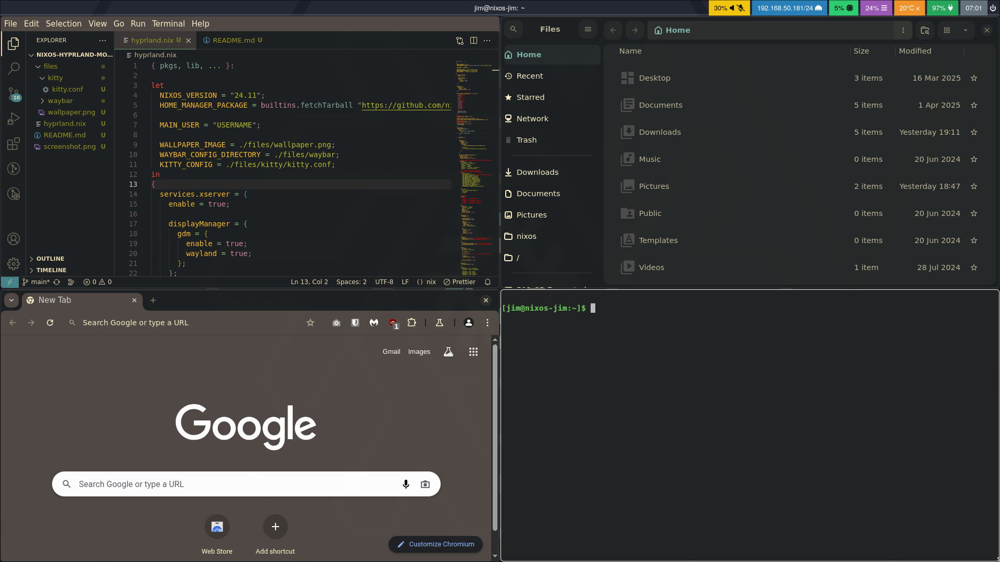
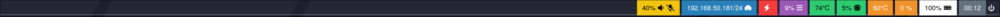

# nixos-hyprland-module

Some basics configurations for `hyprland` on `nixos`.

Includes configuration example for:

- [`waybar`](https://github.com/Alexays/Waybar)
- [`kitty`](https://github.com/kovidgoyal/kitty)

Includes:

- `chromium`
- `codium`
- `gnome-text-editor`
- `gnome-calculator`
- `seahorse`
- `nautilus`



---

---

# setup

1. clone the repository
2. move the files into `/etc/nixos` directory
3. `import` module in `/etc/nixos/configuration.nix`

`wayland.windowManager.hyprland.settings.monitor` is not set, commented lines shows configurations for a 3 displays layout (left - center - right).

---

# utils

### waybar

Edit `./files/waybar/config.jsonrc`.

#### cpu

Edit `temperature` module accordingly with `thermal-zone` or `hwmon-path` accordingly.

```sh
# check `thermal-zone`
# see https://github.com/Alexays/Waybar/blob/master/resources/config.jsonc#L126
for i in /sys/class/thermal/thermal_zone*; do echo "$i: $(<$i/type)"; done

# check `hwmon-path`
# see https://github.com/Alexays/Waybar/blob/master/resources/config.jsonc#L127
for i in /sys/class/hwmon/hwmon*/temp*_input; do echo "$(<$(dirname $i)/name): $(cat ${i%_*}_label 2>/dev/null || echo $(basename ${i%_*})) $(readlink -f $i)"; done
```

#### gpu

`custom/gpu` and `custom/temperature_gpu` are set for an Nvidia GPU.
Please edit the following according to the device hardware and needs:

```json
"custom/gpu": {
  "format": "{}%",
  "interval": 5,
  "return-type": "",
  "exec": "nvidia-smi --query-gpu=utilization.gpu --format=csv,noheader | sed 's/%//'"
},
"custom/temperature_gpu": {
  "format": "{}°C",
  "interval": 5,
  "return-type": "",
  "exec": "nvidia-smi --query-gpu=temperature.gpu --format=csv,noheader"
},
```



### screenshot

[`hyprshot`](https://github.com/Gustash/Hyprshot) is used to do screenshots (see `key binding` section below).
Screenshots are saved into `~/Pictures/Screenshots` directory.

Directory can be set with with `HYPRSHOT_DIR` env variable:

```nix
wayland.windowManager.hyprland.settings.env = [
  "HYPRSHOT_DIR, $HOME/Pictures/Screenshots"
];
```

### keyring

[`gnome-keyring`](https://wiki.gnome.org/Projects/GnomeKeyring) is used here.

---

# theming

[`nwg-look`](https://github.com/nwg-piotr/nwg-look) is used to set themes, cursor styles, fonts, etc.

(screenshot example uses [`Gruvbox GTK Theme`](https://www.gnome-look.org/p/1681313))

### wallpaper

[`hyprpaper`](https://wiki.hyprland.org/Hypr-Ecosystem/hyprpaper/) is used to set the wallpaper.

Update `./files/wallpaper.png` if needed or set `home-manager.users.${USERNAME}.services.hyprpaper.settings.wallpaper` to another source.

(the current wallpaper comes from the [`nixos-artwork`](https://github.com/NixOS/nixos-artwork) repository)

### kitty

Edit `./files/kitty/kitty.conf`.

### waybar

Edit `./files/waybar/style.css`.

### nautilus

Nautilus requires `GTK_THEME` env variable to be set with the current theme to apply it.

```nix
wayland.windowManager.hyprland.settings.env = [
  "GTK_THEME, Dark-Gruvbox"
];
```

---

# key binding

|                       |                                                                   |
| --------------------- | ----------------------------------------------------------------- |
| `SUPER + 1`           | open app launcher                                                 |
| `SUPER + 2`           | open code editor (`codium`)                                       |
| `SUPER + 3`           | open browser (`chromium`)                                         |
| `SUPER + 4`           | open text editor (`gnome-text-editor`)                            |
| `SUPER + MouseScroll` | move current window to next (`up`) or previous (`down`) workspace |
| `SUPER + Q`           | close current window                                              |
| `SUPER + M`           | logout                                                            |
| `Print`               | open screenshot utility (`hypershot`)                             |

See `wayland.windowManager.hyprland.settings.bind*` for more shortcuts.

---

# documentation and links

- [`hyprland wiki`](https://wiki.hyprland.org/Nix/Hyprland-on-NixOS/)
- [`nixos wiki`](https://nixos.wiki/wiki/Hyprland)
- [`gtk themes`](https://www.gnome-look.org/browse/)
- [`nixos wallpapers`](https://github.com/NixOS/nixos-artwork/tree/master/wallpapers)
